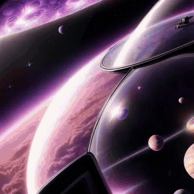
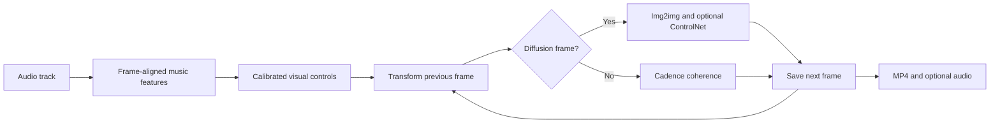

# MusicArtGenerator

MusicArtGenerator turns music into an evolving visual sequence. It extracts
frame-aligned features from an audio track, maps them to readable visual
controls, and uses recurrent Stable Diffusion generation to create a
music-reactive video.

[](examples/assets/twist_preview_with_audio.mp4)

*The animated preview is silent. [Open the MP4 to watch it with music](examples/assets/twist_preview_with_audio.mp4).*

## What It Does

- detects beats, onsets, energy, spectral brightness, and pitch
- aligns every audio feature to the video frame timeline
- maps music features to diffusion strength, CFG scale, noise, zoom, pan,
  rotation, ControlNet scale, cadence, and prompt changes
- starts from a text prompt or an optional initial image
- supports cadence generation, quiet sections, onset jitter, steady movement,
  twist, color coherence, and reference re-anchoring
- saves every frame, a run manifest, and resume state for long generations
- exports a silent MP4 and can add the original audio with `ffmpeg`

## How It Works



The controls stay outside the diffusion model. This makes the connection
between the music and the visual changes easier to inspect and adjust.

## Requirements

- Python 3.10 or newer
- `ffmpeg` available in `PATH`
- a CUDA GPU is strongly recommended for practical generation time
- internet access on the first run to download the pretrained models

The default renderer uses
[`SG161222/Realistic_Vision_V5.1_noVAE`](https://huggingface.co/SG161222/Realistic_Vision_V5.1_noVAE).
When ControlNet is enabled, the default is
[`lllyasviel/sd-controlnet-canny`](https://huggingface.co/lllyasviel/sd-controlnet-canny).

## Installation

```bash
git clone https://github.com/dimcel/MusicArtGenerator.git
cd MusicArtGenerator

python -m venv .venv
source .venv/bin/activate
pip install --upgrade pip
pip install -r requirements-temp.txt
```

On Windows, activate the environment with `.venv\Scripts\activate`.

Install `ffmpeg` separately if needed:

```bash
# macOS
brew install ffmpeg

# Ubuntu or Debian
sudo apt-get install ffmpeg

# Windows
winget install Gyan.FFmpeg
```

Optional FILM, RIFE-related, and acceleration dependencies are listed in
`requirements-optional.txt`.

## Quick Start

Run commands from the repository directory:

```bash
python -m src.music_video_app \
  --audio "path/to/track.wav" \
  --init-image "path/to/starting_image.png" \
  --concept-mode transform \
  --prompt "a luminous landscape evolving through color and motion" \
  --max-seconds 8 \
  --mode cadence \
  --cadence 2 \
  --controlnet \
  --quiet-hold \
  --with-audio
```

The first run can take longer because model files are downloaded. Start with a
short value for `--max-seconds` before generating a complete track.

## Output

A new run creates a directory such as:

```text
output_cadence_20260823_153000_192f/
```

It contains:

```text
frame_00000.png                         saved frame sequence
frame_00001.png
resume_state_<settings>.json            continuation state
output_cadence_<timestamp>_192f.json    run settings and output manifest
output_cadence_<timestamp>_192f.mp4     silent video
output_cadence_<timestamp>_192f_with_audio.mp4
```

Resume an interrupted or completed run with `--resume-dir`. In resume mode,
`--max-seconds` means the additional duration to generate.

## Documentation

- [Examples and presets](examples/README.md)
- [Complete command-line reference](src/music_video_app/README.md)
- Inspect the available arguments with `python -m src.music_video_app --help`

The preferred entrypoint is `python -m src.music_video_app`. The legacy
`test/test_real_music_feature_video.py` wrapper remains available for
compatibility.

## Current Status

MusicArtGenerator is a command-line research prototype developed for a thesis
on music-reactive visual generation. Output is currently fixed at 512 by 512
pixels, generation is computationally expensive, and results depend on the
audio, prompt, initial image, selected controls, model, and hardware.

`--prompt-mode` is retained for compatibility, but its strategy switch is not
fully active. Subject-transition settings are saved in resume state, but they
are not yet fully connected to prompt transitions.

## Responsible Use

Only use audio, images, prompts, and model weights that you have permission to
use. Review the licenses and usage conditions of the selected diffusion and
ControlNet models before publishing generated results.
